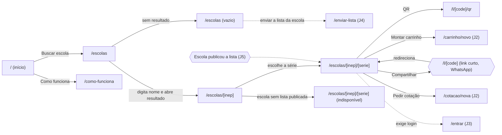
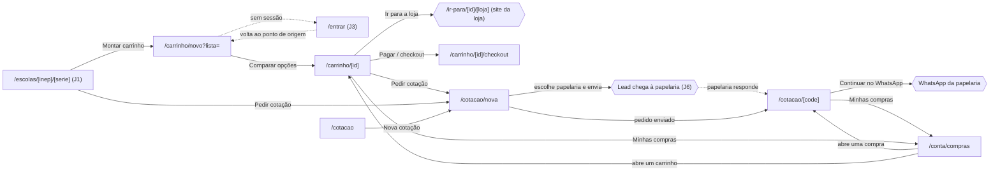
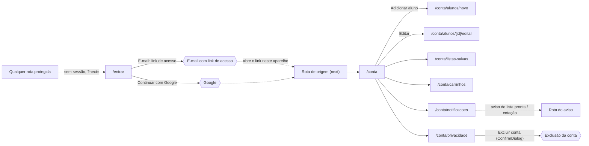
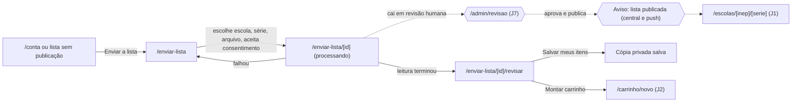
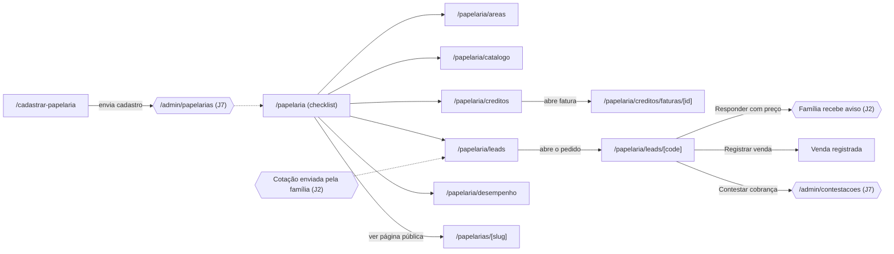
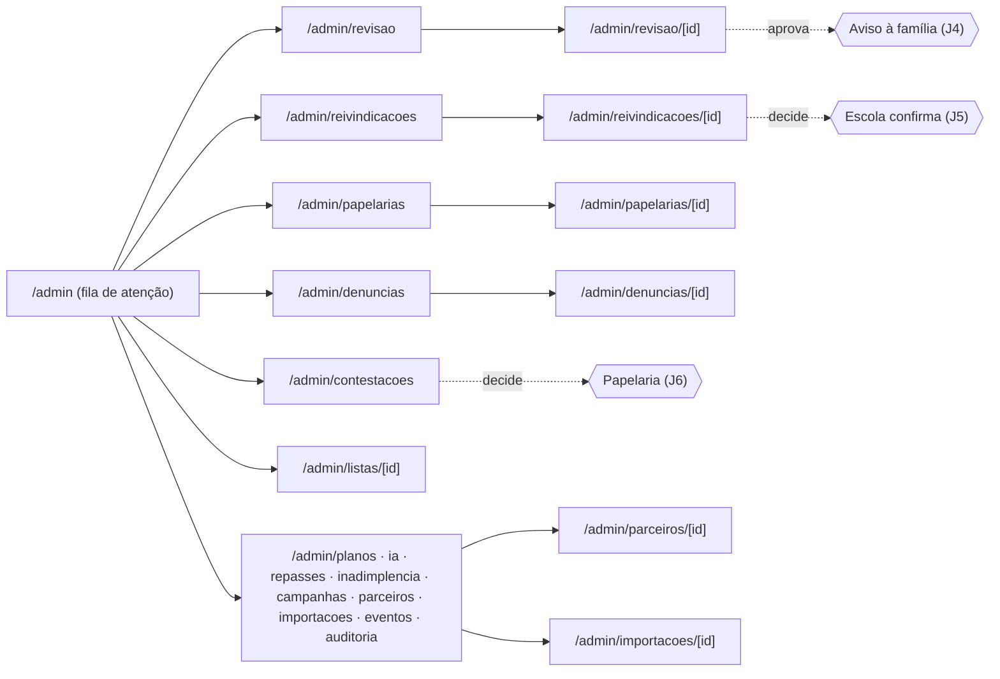
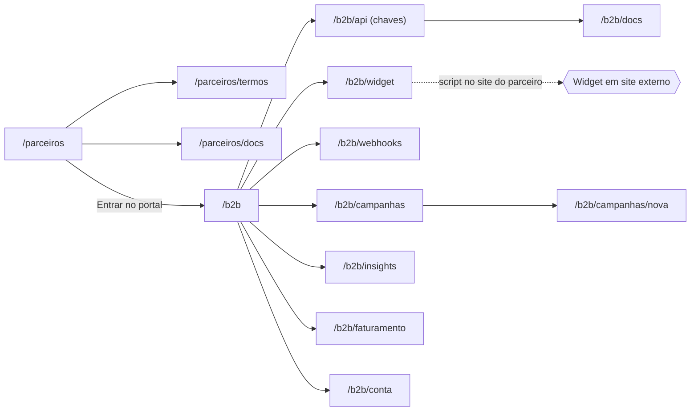
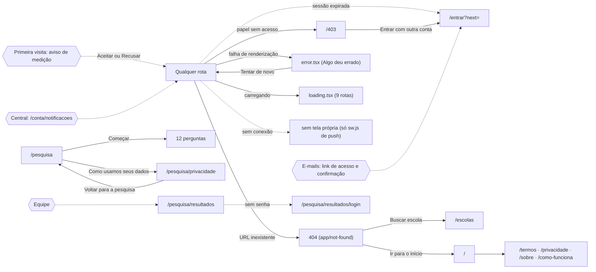

# Mapa de fluxos · S29

Um diagrama por jornada (spec §4). Cada nó é uma rota (`app/**/page.tsx`) ou um estado global; cada aresta é a ação que leva de uma à outra. Linha tracejada e nó em hexágono `{{ }}` marcam **costura entre públicos**: quem age muda (família, escola, papelaria, equipe) ou a ação acontece fora do produto (e-mail, WhatsApp, loja). Rotas com `{x}` recebem dado do banco. As rotas dos passos foram conferidas contra `lib/ux-checks/journeys.ts`; as arestas de J1, J2 e J9 foram percorridas no navegador (fichas em `fichas/`), as demais vêm do código e serão percorridas nas Tasks 6 a 9.

Legenda: retângulo = tela; losango = decisão; hexágono = costura com outro público ou com sistema externo; seta tracejada = passagem sem clique da mesma pessoa (aviso, e-mail, ação de outro papel).

## J1 · Família acha a lista (piloto)

## J2 · Família compra (piloto)

## J3 · Família entra e cuida da conta (piloto)

## J4 · Família envia a lista da escola (piloto)

## J5 · Escola assume e publica (piloto)

```mermaid
flowchart LR
  escola["/escolas/[inep] (J1)"] -->|"Pedir para administrar"| reiv["/escolas/[inep]/reivindicar"]
  reiv -->|"envia evidência e aceite"| adminclaim{{"/admin/reivindicacoes (J7)"}}
  adminclaim -.->|"e-mail de confirmação"| confirmar["/escolas/[inep]/reivindicar/confirmar"]
  confirmar -->|"confirma"| painel["/escola"]
  painel -->|"Nova lista"| nova["/escola/listas/nova"]
  nova -->|"envia arquivo"| revisaoadm{{"/admin/revisao (J7)"}}
  revisaoadm -.->|"publica"| divulg["/escola (divulgação: link curto, QR)"]
  divulg -.-> famlista{{"Família vê a lista (J1)"}}
```

## J6 · Papelaria vende (piloto)

## J7 · Equipe opera (núcleo piloto)

## J8 · Parceiro B2B integra

## J9 · Sistema e bordas (piloto)

