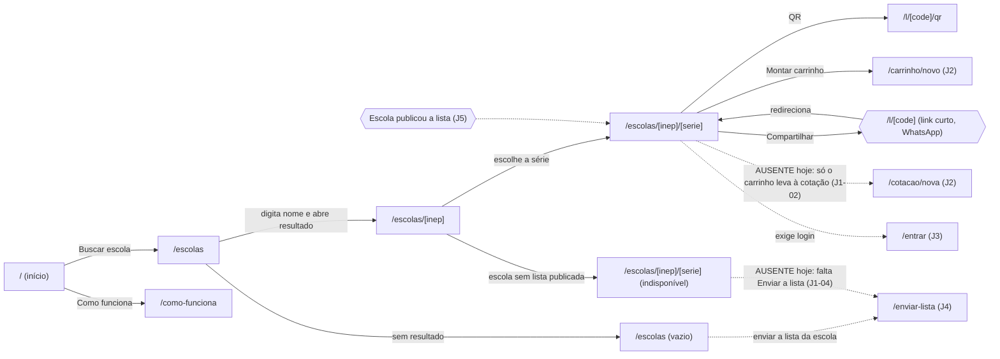
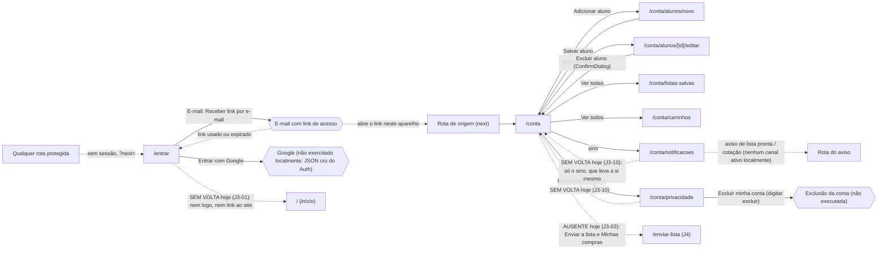
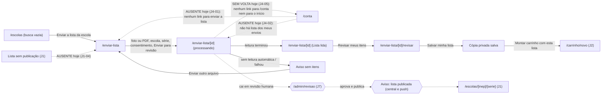
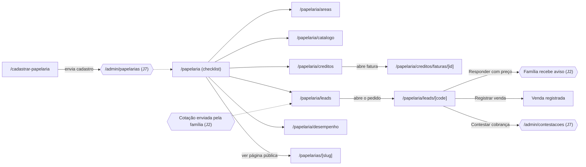
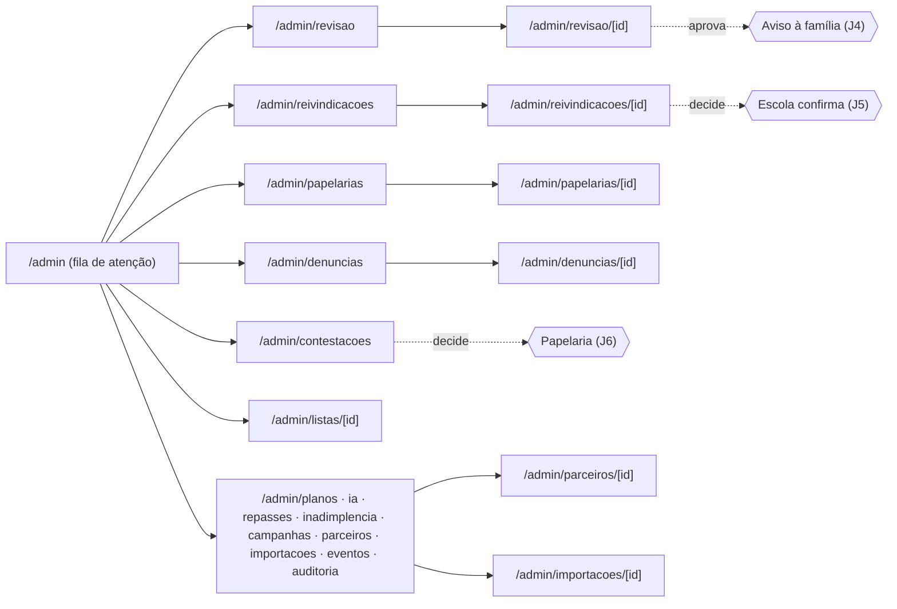
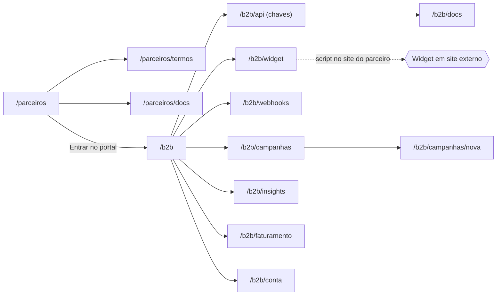
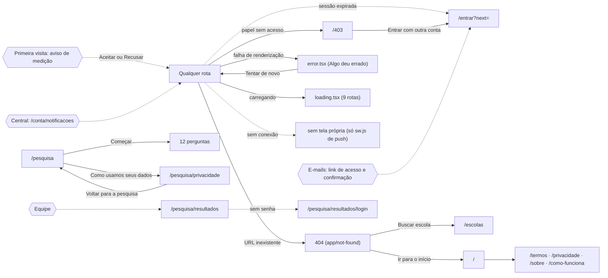

# Mapa de fluxos · S29

Um diagrama por jornada (spec §4). Cada nó é uma rota (`app/**/page.tsx`) ou um estado global; cada aresta é a ação que leva de uma à outra. Linha tracejada e nó em hexágono `{{ }}` marcam **costura entre públicos**: quem age muda (família, escola, papelaria, equipe) ou a ação acontece fora do produto (e-mail, WhatsApp, loja). Rotas com `{x}` recebem dado do banco. As rotas dos passos foram conferidas contra `lib/ux-checks/journeys.ts`; as arestas de J1, J2, J3, J4, J5 e J9 foram percorridas no navegador (fichas em `fichas/`), as demais vêm do código e serão percorridas nas Tasks 7 a 9.

Legenda: retângulo = tela; losango = decisão; hexágono = costura com outro público ou com sistema externo; seta tracejada = passagem sem clique da mesma pessoa (aviso, e-mail, ação de outro papel).

## J1 · Família acha a lista (piloto)

## J2 · Família compra (piloto)

```mermaid
flowchart LR
  lista["/escolas/[inep]/[serie] (J1)"] -->|"Montar carrinho com esta lista"| novo["/carrinho/novo?lista="]
  novo -.->|"sem sessão"| entrar["/entrar (J3)"]
  entrar -.->|"volta ao ponto de origem"| novo
  novo -->|"Comparar opções"| cart["/carrinho/[id] (4 opções)"]
  cart -->|"Escolher esta"| checkout["/carrinho/[id]/checkout (Comprar por loja)"]
  checkout -->|"Buscar / Abrir busca de item"| irpara["/ir-para/[id]/[loja]"]
  irpara -->|"Abrir loja"| loja{{"Site da loja"}}
  irpara -->|"Voltar ao carrinho (leva ao checkout)"| checkout
  cart -->|"Pedir cotação a papelarias"| escolhe["/cotacao/nova?carrinho="]
  escolhe -->|"Pedir pelo WhatsApp"| consent["/cotacao/nova?carrinho=&papelaria="]
  consent -->|"Confirmar pedido de cotação"| cot["/cotacao/[code]"]
  consent -.->|"lead chega à papelaria"| papelaria{{"/papelaria/leads (J6)"}}
  papelaria -.->|"papelaria responde"| cot
  cot -->|"Abrir WhatsApp"| wa{{"WhatsApp da papelaria"}}
  cot -->|"Voltar"| idx["/cotacao"]
  conta{{"/conta (J3)"}} -->|"Minhas cotações"| idx
  idx -->|"abre um pedido"| cot
  compras["/conta/compras"]
  cot -. "SEM LINK hoje (J2-01): a pergunta Você comprou nesta papelaria? é órfã" .-> compras
  compras -.->|"Comprei aqui: registra a venda (J6)"| papelaria
```

## J3 · Família entra e cuida da conta (piloto)

Percorrida no navegador (fichas/J3.md). O link de acesso chegou pelo Mailpit local e voltou à rota de origem; o Google não está configurado localmente.

## J4 · Família envia a lista da escola (piloto)

Percorrida no navegador (fichas/J4.md) com foto real de 7,5 MB. Sem `OPENROUTER_KEY` local, o envio termina em "Leitura automática indisponível"; os estados "lendo" e "lista lida com itens" não foram exercitados.

## J5 · Escola assume e publica (piloto)

Percorrida no navegador (fichas/J5.md) com `escola@` (membro aprovado) e `familia@` (pedido de administração de uma escola sem administrador, criada só no banco local: o seed tem uma escola única, já com administrador). Confirmação por link e decisão da equipe não foram exercitadas.

```mermaid
flowchart LR
  escola["/escolas/[inep] (J1)"] -->|"Pedir para administrar (só escola sem administrador)"| reiv["/escolas/[inep]/reivindicar"]
  escola -. "escola com administrador: só aviso, sem saída (J5-08)" .-> reiv
  reiv -->|"método, nome, cargo, consentimento: Continuar"| arq["/reivindicar (enviar arquivos)"]
  arq -->|"Enviar para análise"| analise["/reivindicar (Em análise)"]
  analise -. "SEM VOLTA hoje (J5-09): Cancelar leva à escola; /conta e /escola 403 não citam o pedido" .-> conta{{"/conta (J3)"}}
  analise -.->|"pedido chega à equipe"| adminclaim{{"/admin/reivindicacoes (J7)"}}
  adminclaim -.->|"decide; aviso na central"| painel["/escola"]
  adminclaim -.->|"e-mail com link (método e-mail)"| confirmar["/escolas/[inep]/reivindicar/confirmar"]
  confirmar -->|"Confirmar e-mail da escola"| analise
  painel -->|"Pedir para administrar outra escola"| busca["/escolas (busca)"]
  painel -->|"Ver a lista publicada"| escolapub["/escolas/[inep] (J1)"]
  painel -. "AUSENTE hoje (J5-01): com lista publicada nada leva ao envio de outra série" .-> nova["/escola/listas/nova"]
  nova -->|"Enviar para revisão"| statusfam["/enviar-lista/[id] (tela da família, J4)"]
  statusfam -. "SEM VOLTA hoje (J5-03): nenhum link para /escola nem lista de envios da escola" .-> painel
  nova -. "SEM VOLTA a 390 px (J5-02): sem cabeçalho nem menu" .-> painel
  statusfam -.->|"cai em revisão humana"| revisaoadm{{"/admin/revisao (J7)"}}
  revisaoadm -.->|"publica; aviso"| divulg["/escolas/[inep]/[serie] (J1)"]
  painel -. "AUSENTE hoje (J5-11): sem compartilhar (link curto, QR, WhatsApp)" .-> divulg
  divulg -.-> famlista{{"Família vê a lista (J1)"}}
```

## J6 · Papelaria vende (piloto)

## J7 · Equipe opera (núcleo piloto)

## J8 · Parceiro B2B integra

## J9 · Sistema e bordas (piloto)

