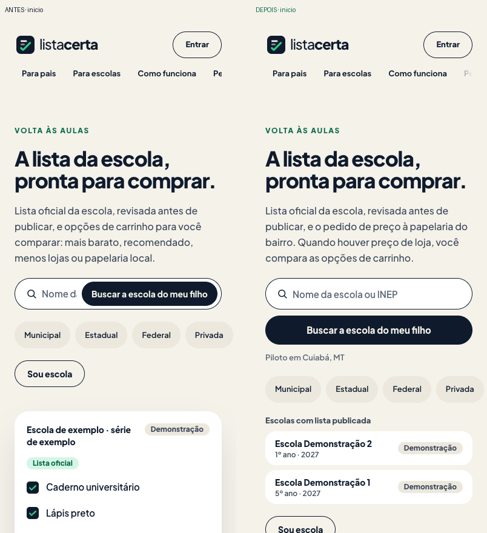
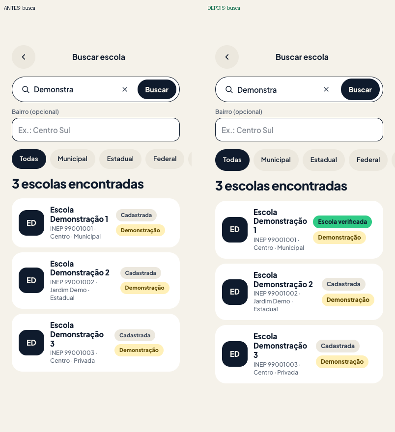
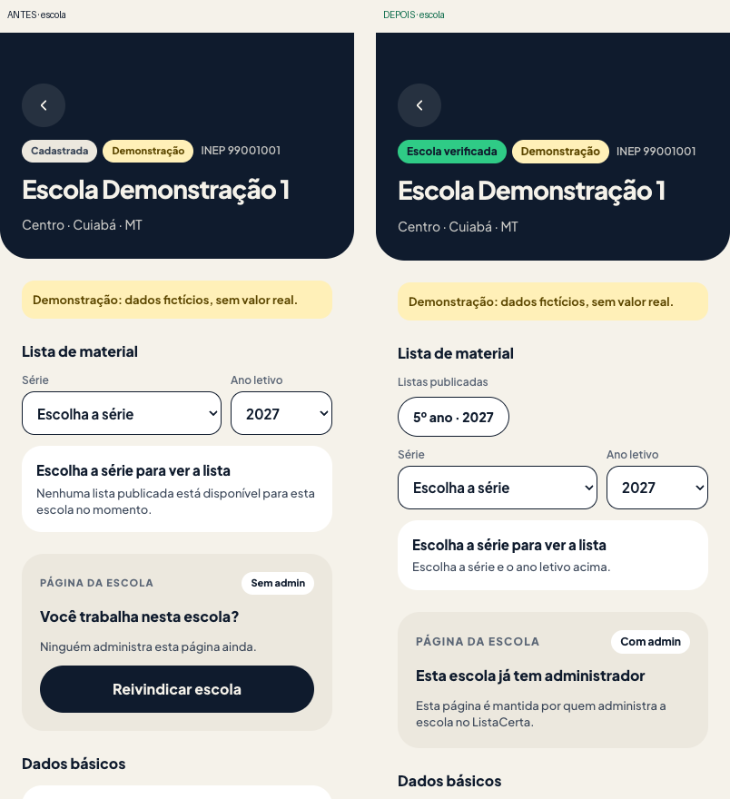
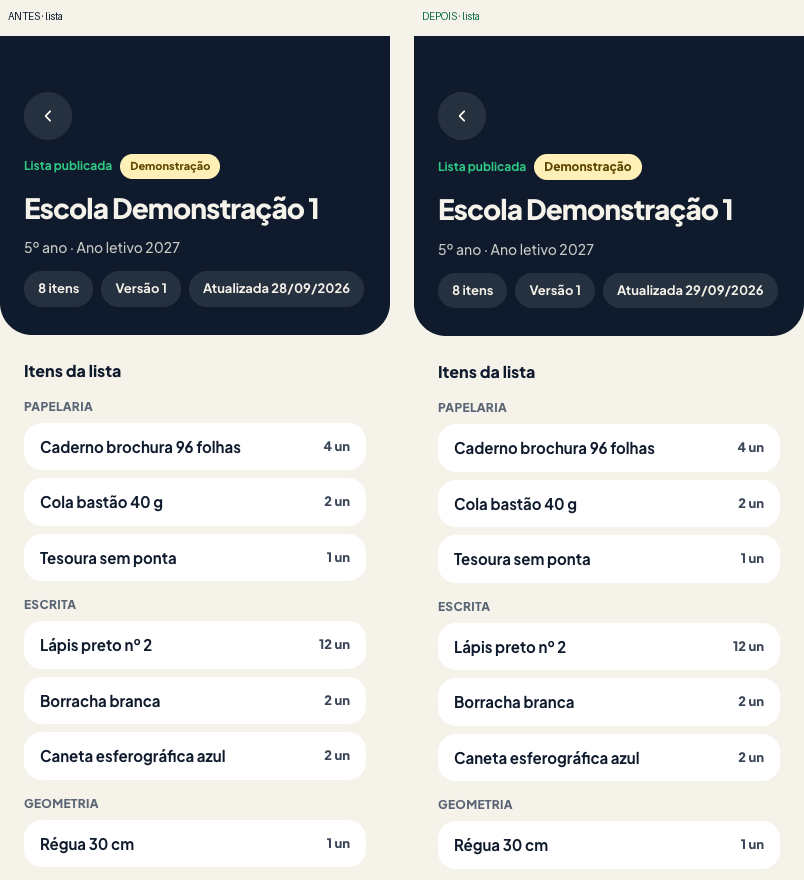
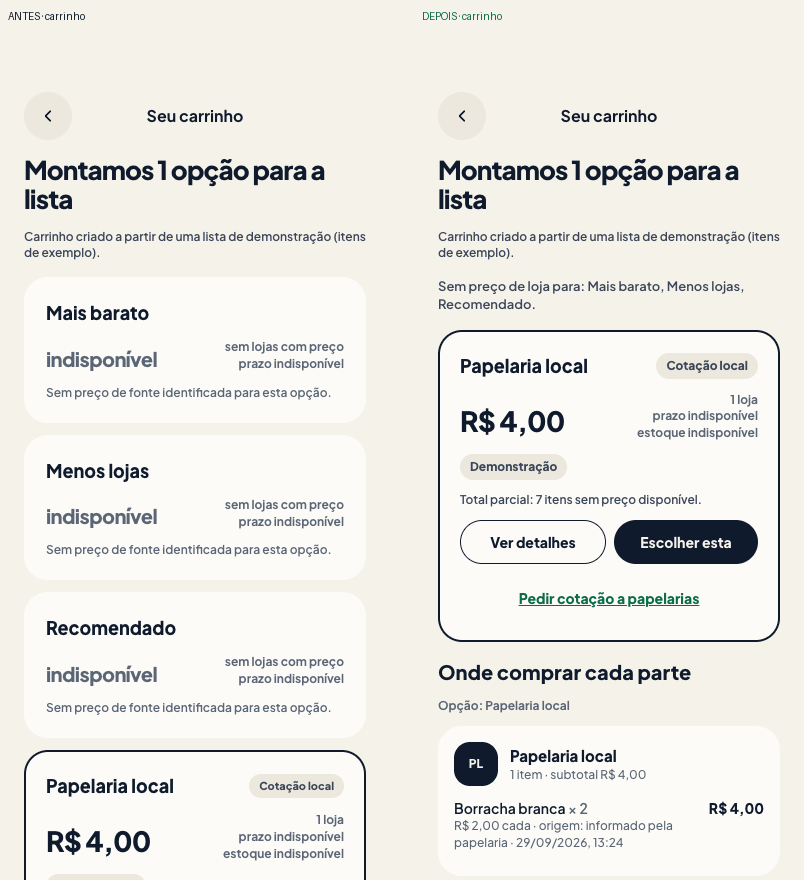
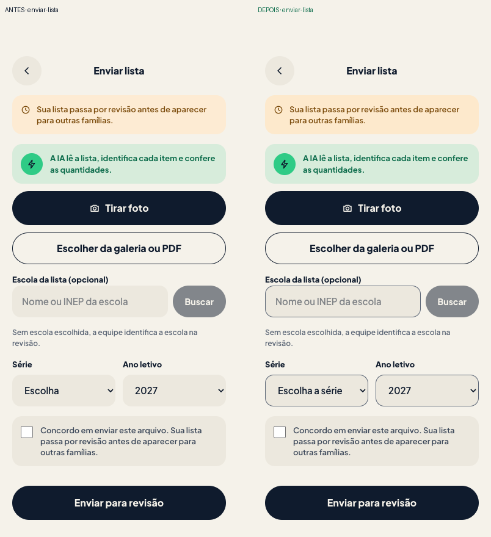
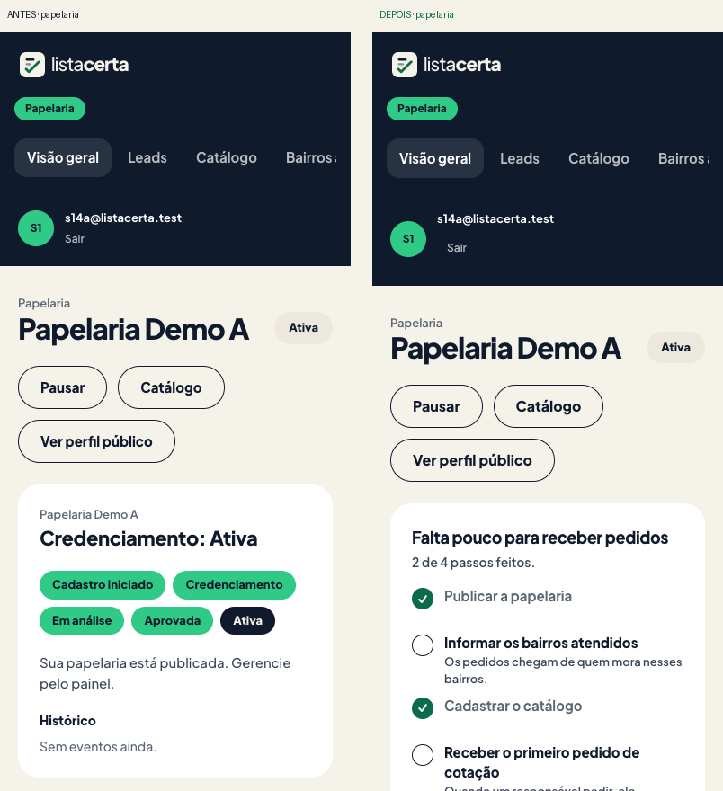
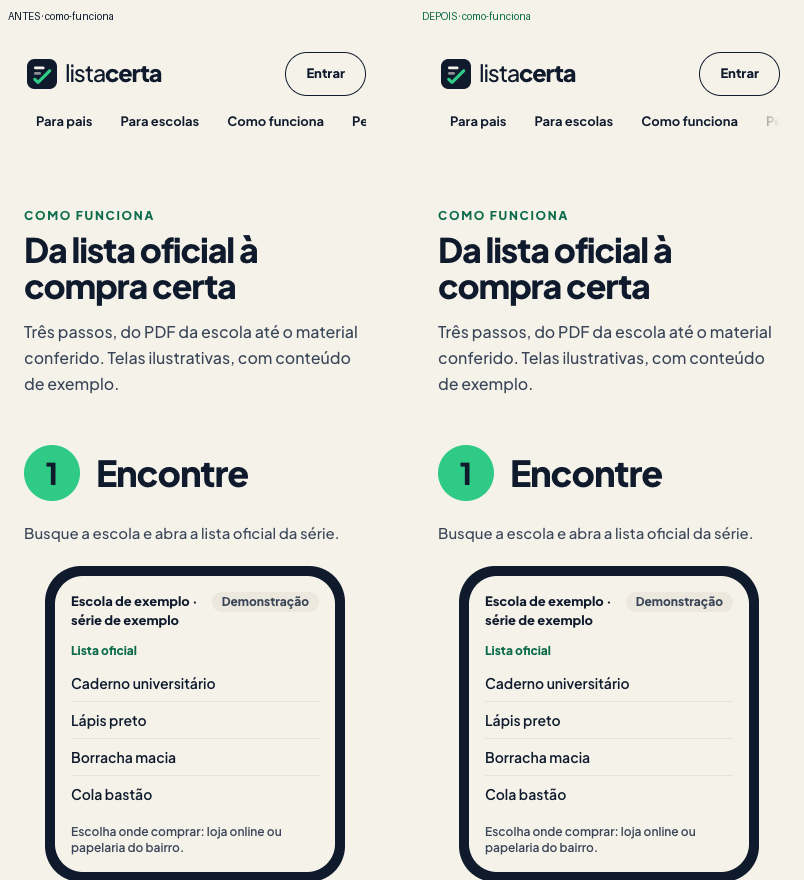

# Antes x depois · S28

Build de produção local (`next start`), Supabase local com dados de demonstração, Lighthouse 12 mobile (4G simulado, CPU 4x), mediana de 3 execuções, axe-core 4.13 a 390x844. Antes: base `1b9fb28` (sem S19). Depois: com a S19 integrada (CSP com nonce, Sentry). Gerado por `scripts/s28-comparar.py` a partir de `antes/*.md` e `depois/*.md`.

| Página | Rota | Desempenho (antes → depois) | Acessibilidade | LCP | CLS | TBT | axe sérias+críticas | axe moderadas |
|---|---|---|---|---|---|---|---|---|
| inicio | `/` | 95 → 92 | 100 → 100 | 2.9 s → 3.3 s | 0.000 → 0.000 | 56 ms → 42 ms | 0 → 0 | 0 → 0 |
| busca | `/escolas?q=Demonstra` | 91 → 93 | 100 → 100 | 3.0 s → 3.3 s | 0.000 → 0.000 | 206 ms → 38 ms | 0 → 0 | 0 → 0 |
| escola | `/escolas/99001001` | 96 → 92 | 100 → 100 | 2.8 s → 3.3 s | 0.000 → 0.000 | 22 ms → 57 ms | 0 → 0 | 0 → 0 |
| lista | `/escolas/99001001/ef-5?ano=2027` | 96 → 100 | 100 → 100 | 2.8 s → 1.8 s | 0.000 → 0.000 | 22 ms → 31 ms | 0 → 0 | 0 → 0 |
| carrinho | `/carrinho/935fa93e-f0ee-4957-9d6f-b834c153ddf9` | 97 → 92 | 100 → 100 | 2.8 s → 3.3 s | 0.000 → 0.000 | 42 ms → 30 ms | 0 → 0 | 0 → 0 |
| enviar-lista | `/enviar-lista` | 93 → 99 | 100 → 100 | 3.3 s → 1.9 s | 0.000 → 0.000 | 48 ms → 33 ms | 0 → 0 | 2 → 0 |
| login | `/entrar` | 100 → 93 | 100 → 100 | 1.8 s → 3.3 s | 0.000 → 0.000 | 20 ms → 38 ms | 0 → 0 | 0 → 0 |
| papelaria | `/papelaria` | 96 → 91 | 100 → 100 | 2.7 s → 3.5 s | 0.000 → 0.000 | 21 ms → 46 ms | 0 → 0 | 0 → 0 |
| como-funciona | `/como-funciona` | 96 → 93 | 100 → 100 | 2.7 s → 3.3 s | 0.000 → 0.000 | 18 ms → 27 ms | 0 → 0 | 0 → 0 |
| cotacao-nova | `/cotacao/nova` | - → 100 | - → 100 | - → 1.8 s | - → 0.000 | - → 22 ms | n/m → 0 | n/m → 0 |
| conta | `/conta` | - → 93 | - → 100 | - → 3.2 s | - → 0.000 | - → 34 ms | n/m → 0 | n/m → 0 |
| escola-painel | `/escola` | - → 93 | - → 100 | - → 3.2 s | - → 0.000 | - → 28 ms | n/m → 0 | n/m → 0 |
| admin | `/admin` | - → 100 | - → 100 | - → 1.9 s | - → 0.000 | - → 33 ms | n/m → 0 | n/m → 0 |
| b2b | `/b2b` | - → 100 | - → 100 | - → 1.9 s | - → 0.000 | - → 25 ms | n/m → 0 | n/m → 0 |
| parceiros | `/parceiros` | - → 92 | - → 100 | - → 3.3 s | - → 0.000 | - → 36 ms | n/m → 0 | n/m → 0 |

n/m = página não medida na linha de base (Task 20 acrescentou as áreas logadas).

## Aceite

- Lighthouse desempenho ≥ 90 nas 7 páginas do aceite (início, busca, lista, carrinho, login, papelaria, como funciona): **sim**.
- Lighthouse acessibilidade ≥ 90 nas mesmas: **sim**.
- axe sem violação séria ou crítica nas mesmas: **sim**.
- Checagens próprias (rolagem, main, h1, alvo de toque, texto < 12 px) em `depois/checks.md`: **0 rota(s) com falha**.

## Capturas lado a lado (390x844)

Esquerda: antes. Direita: depois. Arquivos `depois/lado-a-lado-<página>.png`.

- `inicio`: 
- `busca`: 
- `escola`: 
- `lista`: 
- `carrinho`: 
- `enviar-lista`: 
- `login`: 
- `papelaria`: 
- `como-funciona`: 
